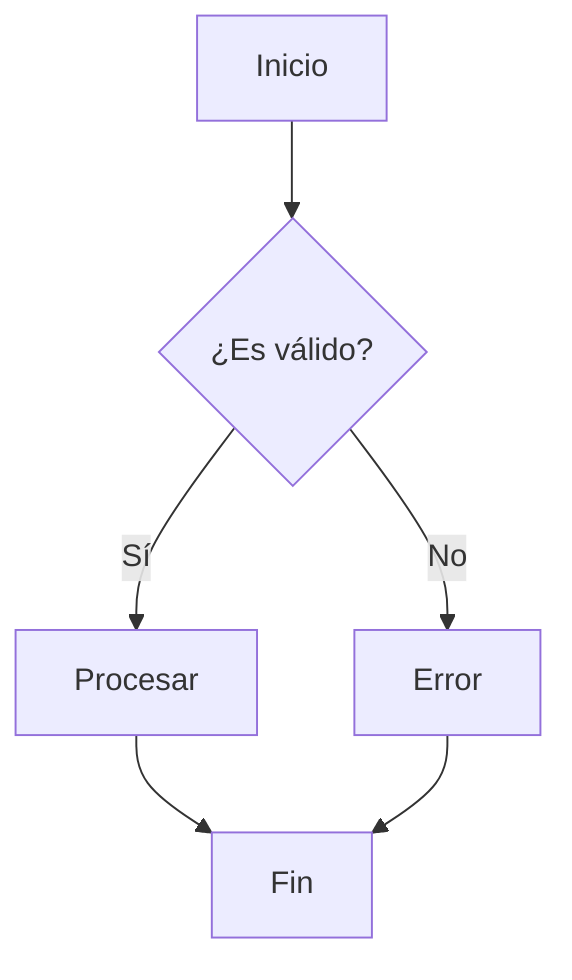
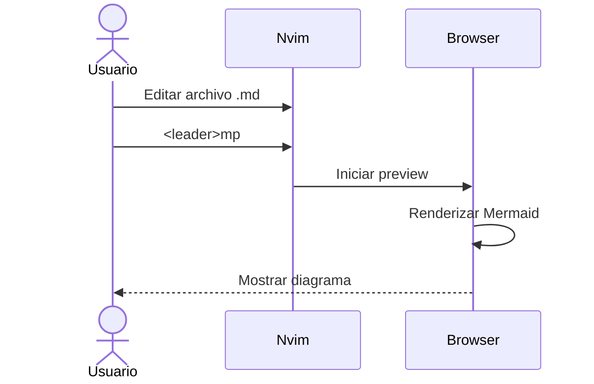
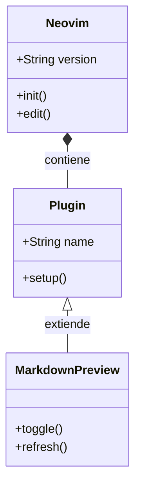
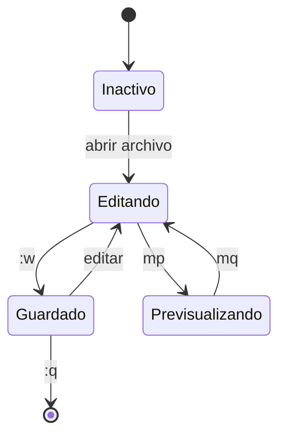
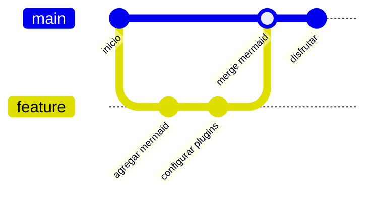
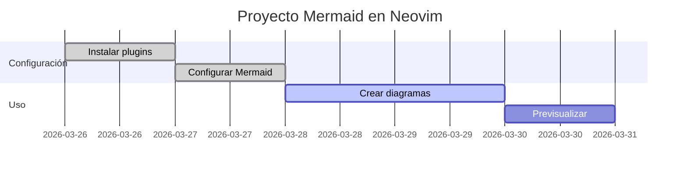
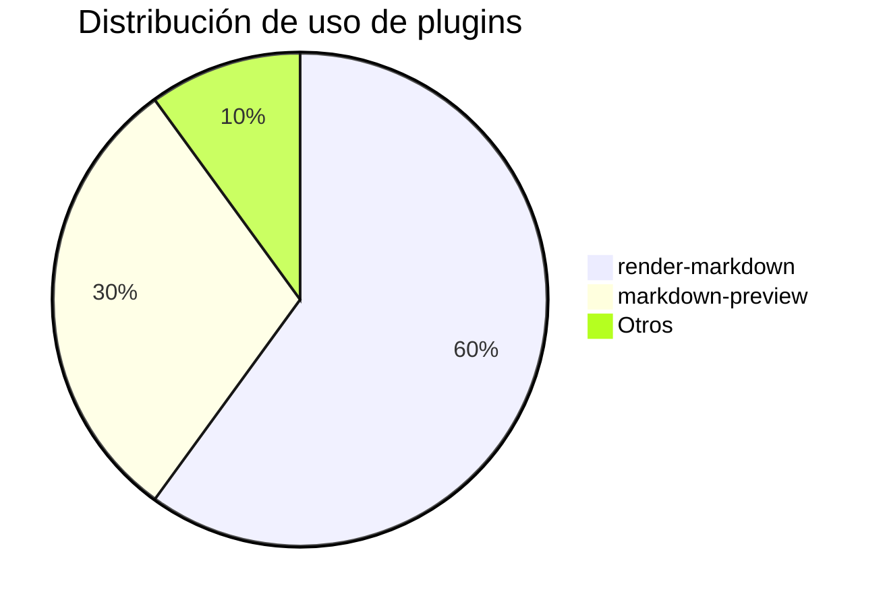

# Ejemplo de Mermaid en Neovim

Este archivo demuestra cómo usar diagramas Mermaid en Markdown con tu configuración de Neovim.

## Atajos disponibles

| Atajo | Descripción |
|-------|-------------|
| `<leader>mp` | Abrir/cerrar previsualización en navegador |
| `<leader>ms` | Iniciar previsualización |
| `<leader>mq` | Cerrar previsualización |
| `<leader>mt` | Toggle renderizado en Neovim |

---

## Diagrama de Flujo

## Diagrama de Secuencia

## Diagrama de Clases

## Diagrama de Estado

## Gráfico de Git

## Diagrama de Gantt

## Diagrama de Pie

---

> [!TIP]
> Usa `<leader>mp` para ver estos diagramas renderizados en tu navegador!

> [!NOTE]
> `render-markdown.nvim` mejora la visualización dentro de Neovim, mientras que `markdown-preview.nvim` renderiza en el navegador con soporte completo de Mermaid.
